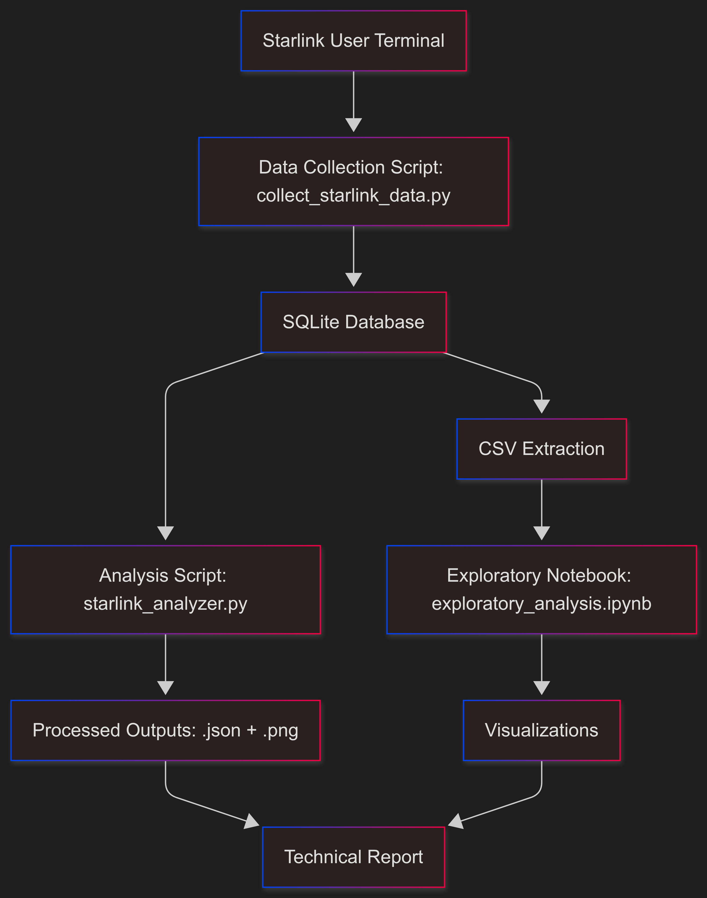

# 🚀 Starlink Satellite Handover Analysis

A modular, data-driven project that investigates the performance and behavior of handovers in SpaceX’s Starlink satellite network. It features data acquisition, preprocessing, metric computation, and result visualization in a fully reproducible architecture.

---

## 🧩 Overview

This repository focuses on analyzing Starlink satellite telemetry to better understand:

- Beam switching and handover frequency  
- Impact on throughput, SNR, and latency  
- Obstruction patterns and packet loss characteristics

Includes structured Python scripts, an interactive notebook, and a formal report documenting findings.

---

## 📡 Architecture & Workflow

> The following visual summarizes how data flows through the system — from raw satellite telemetry to final insight generation.

<p align="center">
  
</p>

---

## 📁 Repository Structure

```

.
├── data/
│   ├── raw/
│   │   └── starlink\_sample\_data.csv
│   └── processed/
│       ├── analysis\_results.json
│       └── enhanced\_analysis.json

├── docs/
│   ├── satellite.png                 # Architecture diagram
│   └── technical\_report.pdf          # Formal summary of findings

├── notebooks/
│   └── exploratory\_analysis.ipynb    # End-to-end notebook

├── results/
│   └── visualizations/
│       ├── latency\_distribution.png
│       ├── obstruction\_patterns.png
│       ├── packet\_loss\_analysis.png
│       ├── snr\_throughput.png
│       ├── throughput\_overview\.png
│       └── throughput\_with\_states.png

├── src/
│   ├── data\_collection/
│   │   └── collect\_starlink\_data.py  # Input ingestion module
│   └── analysis/
│       └── starlink\_analyzer.py      # Metric calculations & logic

├── requirements.txt
├── LICENSE
└── README.md

````

---

## ✨ Key Features

- **Data Collection & Processing**: Modular scripts for gathering and parsing satellite telemetry.
- **Metric Analysis**: Includes latency, SNR, throughput, packet loss, and obstruction analysis.
- **Reproducible Architecture**: Structured folder hierarchy for seamless execution and modular re-use.
- **Notebook Walkthrough**: A Jupyter notebook ties everything together for interactive analysis.
- **Publication-Ready Report**: Formal write-up located in `docs/` for stakeholder-friendly summary.

---

## ⚙️ Getting Started

1. **Clone the repository**
   ```bash
   git clone https://github.com/ritunjaym/starlink-satellite-handover-analysis.git
   cd starlink-satellite-handover-analysis
    ```

2. **Create virtual environment & install dependencies**

   ```bash
   python3 -m venv .venv
   source .venv/bin/activate
   pip install -r requirements.txt
   ```

3. **Run analysis scripts**

   ```bash
   python src/data_collection/collect_starlink_data.py
   python src/analysis/starlink_analyzer.py
   ```

4. **Explore interactive notebook**

   ```bash
   jupyter lab notebooks/exploratory_analysis.ipynb
   ```

---

## 📄 Technical Report

A publication-style PDF summarizing all key findings, visualizations, and methods is located in:

```
docs/technical_report.pdf
```

---

## 🔍 Example Visualizations

From the `results/visualizations` folder:

* 📉 **Latency Distribution**
* 🌐 **Throughput with and without obstruction**
* 📶 **SNR–Throughput trends**
* ❗ **Packet Loss Pattern Analysis**

*(All visuals are discussed in the notebook and report.)*

---

## 📜 License

This project is licensed under the [MIT License](LICENSE).
